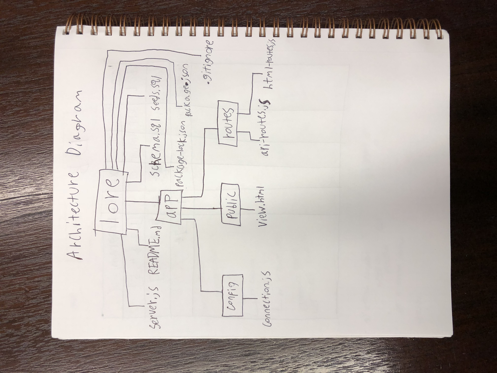
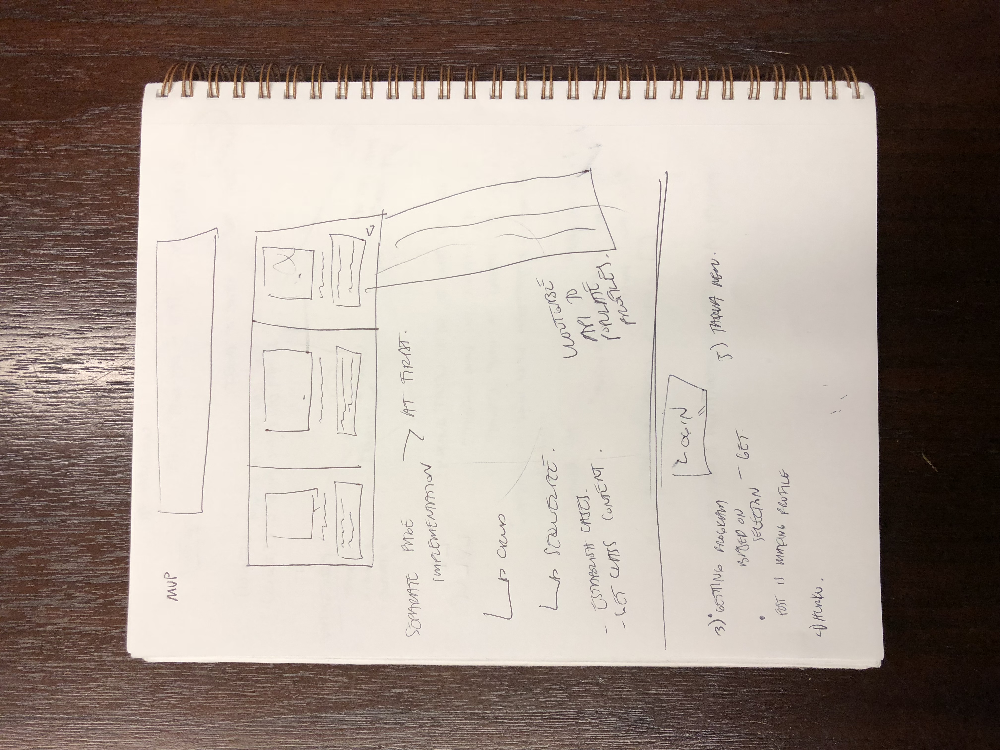
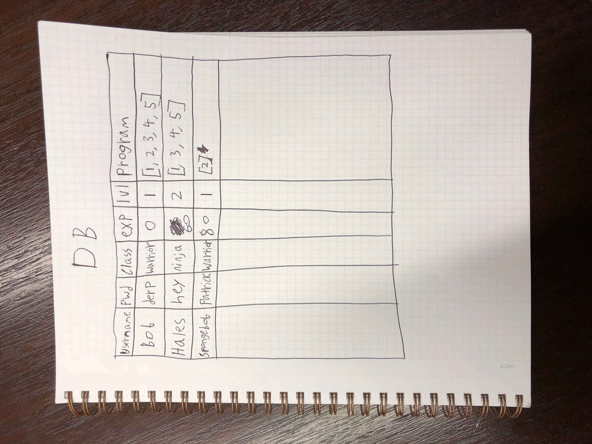

# Lore
**Description**

A physical fitness RPG application that rewards users with a level up system.

**Key Features**

- User database
- Personalized workout API
- RPG game themed

**Tech Used**

- Node.js
- Sequelize
- MySQL
- Express
- Express-handlebars
- Body-Parser
- .env

**Architecture Diagram**

**UI Mockups**

**API Docs**

[To Be Completed]

**DB**

**Getting Started**

Npm init followed by NPM install for getting all dependicies. 

**Team Members**

Dan, Li, Maria, Taqwa
